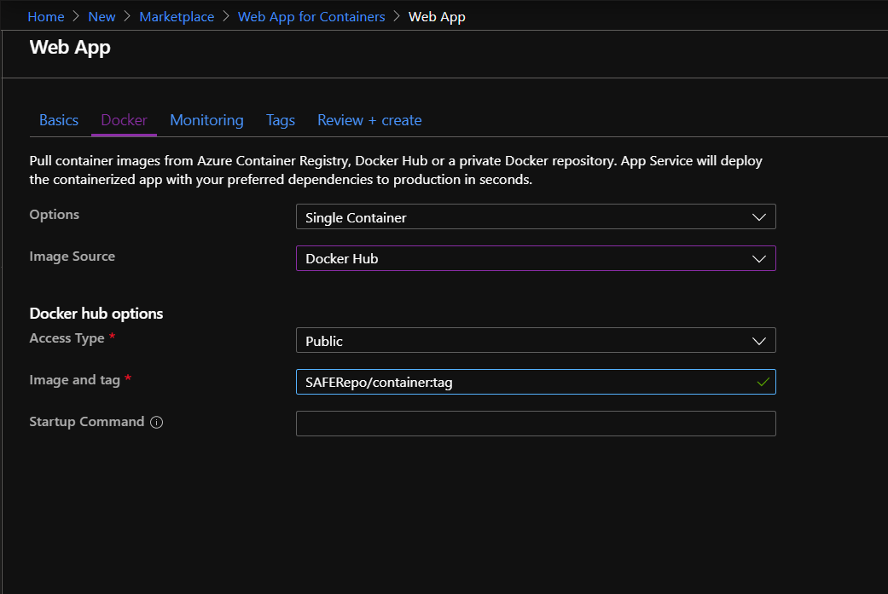
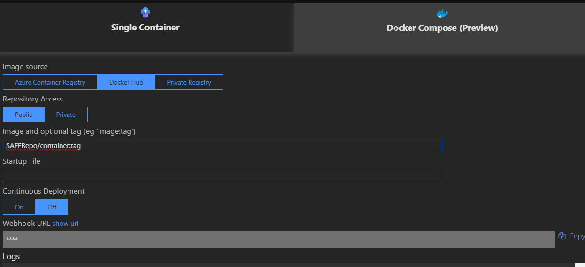

The SAFE template has the ability to easily create a [Docker](https://www.docker.com/) container. The details of the additions to the FAKE script are shown here. For this deployment option SAFE uses the Linux containers and therefore you need docker installed on your machine and configure it to run with [Linux containers](https://docs.microsoft.com/en-us/virtualization/windowscontainers/deploy-containers/linux-containers).

## Custom FAKE build tasks

1. **Bundle** - all necessary artifacts for both Server and Client are collected for following `Docker` target.
1. **Docker** - based on present `Dockerfile`, docker image is built and tagged using `dockerUser` and `dockerImageName` values from the script.

> Note: Before running the `Docker` target, make sure to modify the default `dockerUser` and `dockerImageName` values in script.

## Testing docker image locally

1. Make sure you have docker installed and created the template with `--deploy docker` option
1. Run `fake build --target docker`
1. Run `docker run -d -it -p 8085:8085 {dockerUser}/{dockerImageName}`
1. Navigate to `{dockerHost}:8085` url

## Docker image

The image is based on [microsoft/dotnet:runtime](https://hub.docker.com/r/microsoft/dotnet/).
Entrypoint for the image is `dotnet Server.dll` (with `/Server` working directory).
To allow incoming traffic, port 8085 is exposed.

## Release to Azure App Service

The following part shows how to set up automatic deployment to [Microsoft Azure](https://azure.microsoft.com).

Currently, SAFE template doesn't contain additional FAKE build targets to deploy a Docker image directly to Azure, so you'll need to grab (and possibly adjust) **additional FAKE "Deploy" target** from [SAFE BookStore](https://github.com/SAFE-Stack/SAFE-BookStore/blob/master/build.fsx) build script.

Following steps assume you've added the necessary build script fragments from SAFE BookStore.

### Docker Hub

Create a new [Docker Hub](https://hub.docker.com) account and a new public repository on Docker Hub.

### Release script

Create a file called `release.cmd` with the following content and configure your DockerHub credentials:

    @echo off
    cls

    fake build --target Deploy "DockerLoginServer=docker.io" "DockerImageName=****" "DockerUser=****" "DockerPassword=***" %*

Don't worry the file is already in `.gitignore` so your password will not be commited.

### Initial docker push

In order to release a container you need to create a new entry in [RELEASE_NOTES.md] and run `release.cmd`.
This will build the server and client, run all test, put the app into a docker container and push it to your docker hub repo.

### Azure Portal

Go to the [Azure Portal](https://portal.azure.com) and create a new "Web App for Containers".
Configure the Web App to point to the docker public repository and type in an image and tag.

"WebHook Url" to trigger new deployment after new image comes into your Docker Hub repo. Is available in `Settings/Container Settings` of your deployed app

*Note that startup command is not necessary.*

The `Dockerfile` used to create the docker image exposes port 8085 for the Giraffe server application. This port needs to be mapped to port 80 within the Azure App Service for the application to receive http traffic.

Presently this can only be done using the Azure CLI. You can do this easily in Azure Cloud Shell (accessible from the Azure Portal in the top menu bar) using the following command:

`az webapp config appsettings set --resource-group <resource group name> --name <web app name> --settings WEBSITES_PORT=8085`

The above command is effectively the same as running `docker run -p 80:8085 <image name>`.

Now you should be able to reach the website on your `yourapp.azurewebsites.net` url.

### Further releases

Now everything is set up. By creating new entries in [RELEASE_NOTES.md] and a new run of `release.cmd` the website should update automatically.

Alternatively, you can use the [ARM deploy option](template-appservice.md) to do automatic deployment to the Azure App Service platform.
