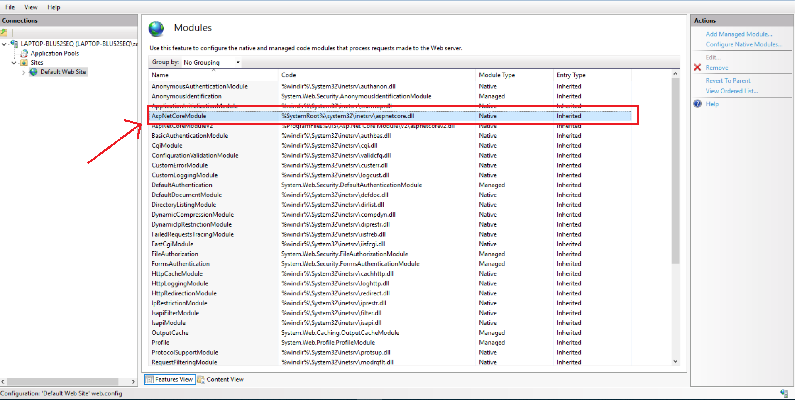
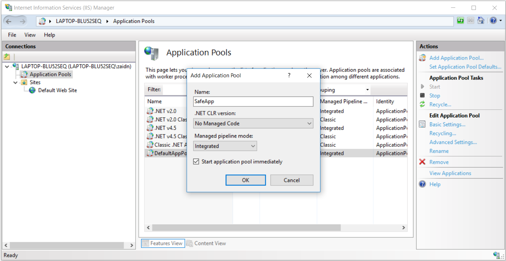
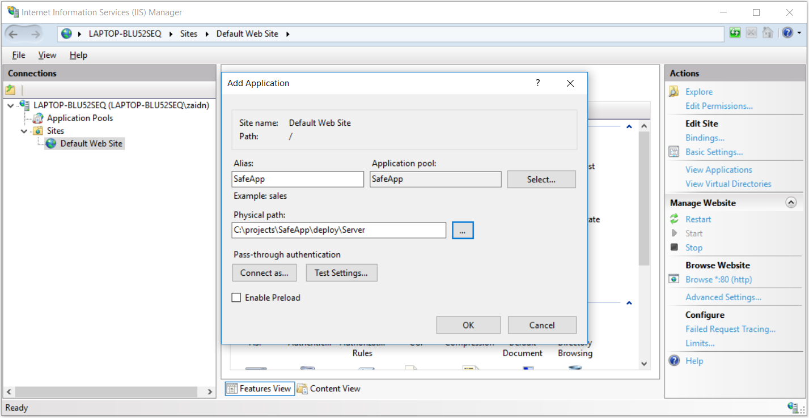
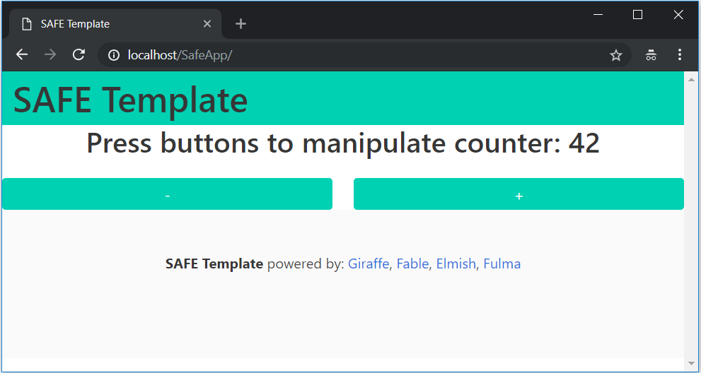

# Deploy to IIS 

The SAFE template can be easily deployed to [IIS](https://www.iis.net/), either on-premise or on a hosted virtual machine running Windows. To get started, scaffold the template with the deploy option set to IIS:

```bash
dotnet new SAFE --deploy iis
```

The template will include a custom FAKE build target called `Bundle` to get the application that packages your application and makes it ready for deployment, run this target using:

```
fake build --target bundle
```

When the target finishes running succesfully, you will have a new `deploy` directory with this structure:
```
{template root}
 |
 | - deploy
       | - Client
       | - Server 
``` 
Your app is now ready for deployment. 

# Setting up IIS

### ASP.NET Core module
Like with any dotnet core app hosted within IIS, you will need to have the `AspNetCoreModule` installed in IIS<sup>*</sup>. This is a native module that starts your dotnet app in a child process of IIS and proxies all http requests coming from IIS to the application.




> Note that for netcoreapp2.2, you will need AspNetCoreModule and *not* AspNetCoreModuleV2.

### Create an Application Pool
Hosting dotnet core on IIS does not support Application Pool sharing which means every dotnet application has it's own application pool, create a new one, give it the name of the application, for example `SafeApp` and make sure to set the .NET CLR version to `No Managed Code`: 



### Add Application
Now that the application pool is setup, we can our application to it. When Adding an application, you give it an ailias, and a physical path. In our case, because this is the only application in the application pool, lets just name it `SafeApp` and the physical path of the application is the *Server* directory of the bundled deployment directory:

```bash
{template root}
 |
 | - deploy
       | - Client
       | - Server <--- the physical path
```
Here I will adding the application to the default (root) website of IIS 

 

Now your application should be up and running!



### Deploying a new version
 - Stop the application pool
 - Replace the contents of the deployment directory 
 - Restart the application pool


### Client developement considorations

When hosting inside IIS, your application will most likely run inside a virtual path like in the above example. This means that requests made using fetch will not work by default:
```fs
// will not work
fetchAs<Customer list> "/api/customers" 
```
To solve this, the template includes a module `ServerPath` with a function to normalize the routes, so instead of the above you would have:
```fs
// this works
fetchAs<Customer list> (ServerPath.normalize "/api/customers")
```
You will have to this for every request you make, unless you are using remoting which is done only once during proxy setup. 

Be careful not to forget `ServerPath.normalize`, because if you forget it during developement, the route still works because there is no IIS but then when you deploy the app, the route won't work any more because of the virtual paths.

